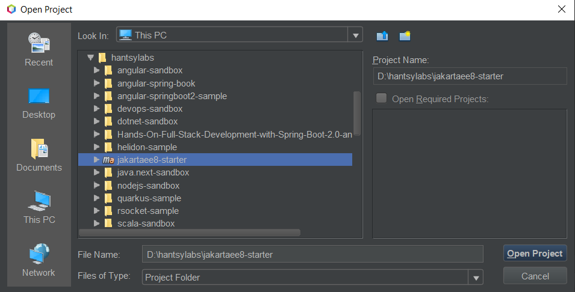

# Kickstart a Jakarta EE 8 Application
[Jakarta EE 8](https://jakarta.ee/) was released  at the first [Jakarta EE One](https://jakartaone.org/) online conference which was driven by Eclipse foundation. 

Jakarta EE 8 is the first version released by Eclipse Foundation.  Compared to the previous Java EE 8, the new Jakarta EE 8 neither introduced new specifications nor updated the existing ones , the main work was moving all specifications to  Eclipse foundation, and cleaning up the issues of license.  Now Jakarta EE is completely a community driven  project, more info about Jakarta EE 8, please navigate the official [Jakarta EE website](https://jakarta.ee/).  

This project - [Jakarta EE 8 starter](https://github.com/hantsy/jakartaee8-starter) is a boilerplate project to help you to bootstrap a new  Java EE 8/Jakarta EE 8 application in seconds.

 [](https://github.com/hantsy/jakartaee8-starter/actions)

[TOC]

## Prerequisites

Before starting a new Jakarta EE 8 project, I assume the following software have been installed into your local machine.

* The latest JDK 8, not limited to:
  * [Oracle JDK 8](https://java.oracle.com) 
  * community-driven [AdoptOpenJDK 8](https://adoptopenjdk.net/releases.html) 
  * Other JDK maintained by Redhat, etc.
* One of the following Jakarta EE 8 compatible products to serve your application:
  * [Glassfish v5.1](https://projects.eclipse.org/projects/ee4j.glassfish/downloads)
  * [Payara Server 193 Full](https://www.payara.fish/software/downloads/)
  * [Wildfly 17.0.1](https://wildfly.org/downloads)
  * [OpenLiberty 19.0.0.9]( https://openliberty.io/downloads/)
* Your favorite IDEs, not limited to:
  * [Eclipse IDE](https://eclipse.org)
  * [Apache NetBeans IDE](http://netbeans.apache.org)
  * [Intellij IDEA ](https://www.jetbrains.net)

## Bootstrap a new Jakarta EE project

Click the [**Use this template**](https://github.com/hantsy/jakartaee8-starter/generate) button to use this project as template  and generate a new repository under  your Github account, them check out the source codes from your Github account.

```bash
git clone https://github.com/<your account>/<your jakartaee project>
```

Or check out the source codes of this project into your local system directly,  and push it back to your Github account later.

```bash
git clone https://github.com/hantsy/jakartaee8-starter
```

The source codes are built by Apache Maven.  Nowadays most of the popular IDEs support building with Apache Maven very well.

First of all, import the source codes into your  favorite IDE.

### Apache NetBeans

 NetBeans  can recognize Maven  project directly.

1. Open  *File->Open* Project, or click the *Open Project* icon button in the toolbar,  or use *Ctrl+Shift+O* shortcuts to start up the *Open Project* dialog.

2. Select the folder of the source codes, it should be displayed as a NetBeans  Maven project icon.

   

### Eclipse IDE

If Eclipse is your preferred IDE,  to get better experience of Java EE development, the [[Eclipse IDE for Enterprise Java Developers](https://www.eclipse.org/downloads/packages/release/2019-09/r/eclipse-ide-enterprise-java-developers)] is highly recommended. Or you can select a  commercial  version, such as [Red Hat CodeReady Studio](https://www.redhat.com/en/technologies/jboss-middleware/codeready-studio) which is free for developers.

1. Click *File-> Import...* to open the *Import* dialog.
2. Select *Maven/Existing Maven Projects* in tree nodes, and click *Next* button to continue.
3. In the  *Import Maven projects*, select root folder of the source codes.

   
   
4. Click *Finish* button to import the project into the current Eclipse workspace. Please be patient and wait for seconds.


### Intellij IDEA

Intellij IDEA has two versions, the free open-sourced community edition and the full-featured  commercial ultimate edition.  The community edition just contains basic features to develop Java application,  and includes essential supports of other languages, such as Groovy, Kotlin, etc.,   the later has richer support of building an enterprise application.  To work more productive, you should consider to buy a commercial  license. 

1. Click *File->New->Project from Existing Sources...*. from main menu.
2. In the *Select File or Directory  to Import...* dialog, select the folder node of the source codes, click *Ok* button.
3. In the *Import project...* dialog, select *Import from external model* option, and select *Maven* in list, click *Finish* button.

## Explore the Sample Codes

Now let's take a glance at the sample codes, by default the project file structure looks like the following:

```bash
├── .github
│   ├── ISSUE_TEMPLATE
│   │   └── bug_report.md
│   └── workflows
│       └── maven.yml
├── src
│   ├── main
│   │   ├── java
│   │   │   └── com
│   │   │       └── example
│   │   │           ├── GreetingMessage.java
│   │   │           ├── GreetingResource.java
│   │   │           ├── GreetingService.java
│   │   │           └── JaxrsActivator.java
│   │   └── resources
│   │       └── META-INF
│   │           └── beans.xml
│   └── test
│       ├── java
│       │   └── com
│       │       └── example
│       │           ├── it
│       │           │   ├── GreetingResourceTest.java
│       │           │   └── GreetingServiceTest.java
│       │           └── GreetingMessageTest.java
│       └── resources
│           └── arquillian.xml
├── .gitignore
├── LICENSE
├── pom.xml
└── README.md

```

The **.github** folder holds the Github specific configurations, eg, issue templates, Github Actions workflows. 

The *src/main/java* includes some sample codes:

*  `GreetingMessage` is a simple POJO presenting a greeting message.  
* `GreetingService` is a simple CDI managed bean used to building a greeting message.  
*  `GreetingResource` is a simple JAX-RS resource to expose RESTful APIs. 
*  `JaxrsActivator` is the JAX-RS application class which is used to activate JAX-RS in Jakarta EE  applications.

The *src/main/java/resources/META-INF/beans.xml* is a CDI configuration file.

The *src/test/java* includes some ample codes for testing purpose.

The *src/test/java/resources/arquillian.xml*  is a [ JBoss Arquillian](http://arquillian.org/)  sample configuration file.


## Resources 

* [WildFly Maven Plugin (wildfly-maven-plugin)](https://docs.jboss.org/wildfly/plugins/maven/latest/index.html)
* [Deploying to Payara Server Using the Maven Cargo Plugin](https://blog.payara.fish/deploying-to-payara-server-using-the-maven-cargo-plugin)  by Payara Blog
* [Cargo Maven2 Plugin for Glassfish v5](https://codehaus-cargo.github.io/cargo/GlassFish+5.x.html)