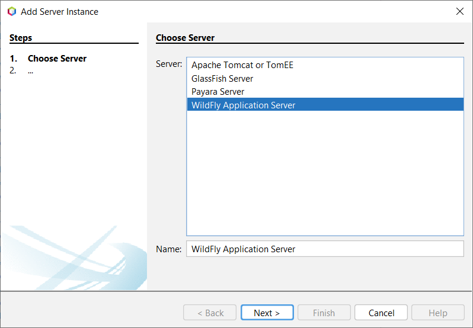
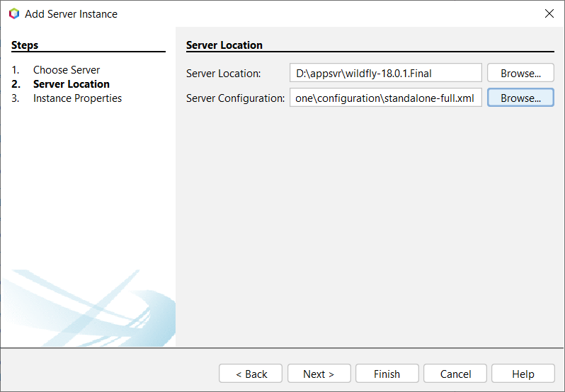
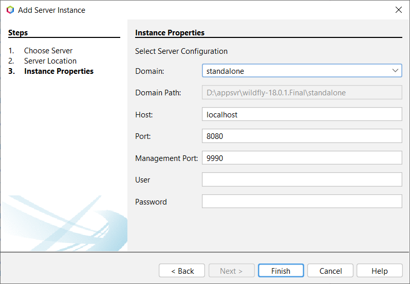

# Deploying applications to WildFly Server using Apache NetBeans IDE

NetBeans has built-in support for Glassfish.  

[toc]

## Install WildFly Application Server plugin

1. Download [WildFly Application Server plugin](http://plugins.netbeans.org/plugin/76472/wildfly-application-server) from NetBeans Plugins portal.
2. Opens *Pluigns* dialog from main menu *Tools*->*Plugins*.
3. Switch to *Downloaded* tab, and click *Add* button to select the downloaded plugin(a .nbm file).
4. When it is added, click *Install* button to start installation.
5. Follow the guide of the installation wizard, and restart NetBeans IDE to apply the change.

## Add a WildFly Server instance

Firstly, you should add a WildFly Server instance in NetBeans.

1. Click *Windows->Services* or use *Ctrl+5* shortcuts to open *Services* view .
2. Right click  the *Servers* node, select *Add Server...* in the context menu.
3. In the *Add Server Instance* dialog, there are three steps:
   * *Choose Server* :select *WildFly Application Server* in the server list, click *Next* button.
   
     
   
   * *Server Location*: select the WildFly server location, click *Next* button.
   
     
   
   * *Instance Properties*: use the default values, if you have set an administration user, fill them in *User* and *Password* fields, click *Finish* button.
   
     

After it is done, there is a new node *WildFly Application Server* added under the *Server*s nodes.


Right click the *WildFly Application Server* node, there is a few actions available for you to control the server instance, such as Start, Stop, Debug etc. 

## Start and Stop WildFly Server

Let's start the WildFly server by click *Start* in the context menu.  Wait for seconds, you will see the *Output* screen similar to the following.


To stop the running WildFly Server,  click *Stop* in the context menu of the existed WildFly Server node. Or jus click the *stop* button the *Notifications* windows.

## Deploy and undeploy applications

## [TODO] the is no WildFly option in the Server list.

Switch to  *Project* view, right click the project node, and select *Run* in the context menu.

In the  *Select deployment server* dialog, select *WildFly Application Server* we have created in the dropdown menu.


Click *OK* button. It will try to build the project and deploy the application package into the NetBeans managed WildFly server.   

After it is deployed successfully, there is a success message similar with the following in the *Output* window.

```bash
------------------------------------------------------------------------
Deploying on WildFlyServer
    profile mode: false
    debug mode: false
    force redeploy: true
In-place deployment at D:\hantsylabs\jakartaee8-starter\target\jakartaee8-starter

```

Let's switch to *Server* view, there several nodes are displayed under WildFly Application Server. Expand the *Application* node, you will see there is a new node *jakartaee8-starter* there.

[TODO: insert the deployed application]

Currently the sample application just includes a simple RESTful APIs which serves at  the */api/greeting* endpoint. 

Open  your terminal and use `curl` to verify the APIs.

```bash
curl http://localhost:8080/jakartaee8-starter/api/greeting/hantsy
{"message":"Say Hello to hantsy at 2019-11-04T16:16:13.509"}
```

To  undeploy the application, in the *Service* view, expand Servers/WildFly Application Server/Applications, right click the *jakartaee8-starter* node, click *Undeploy*  to undeploy it from WildFlyserver. 

